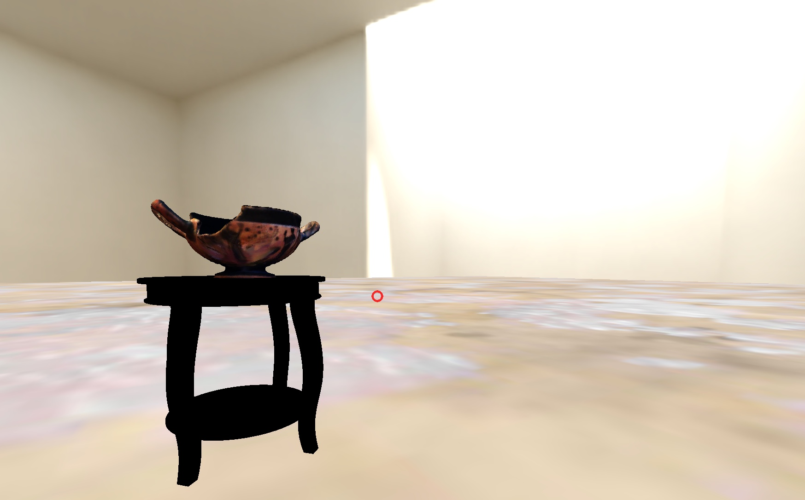

# Welcome

The Virtual Classical Collection is a series of VR galleries featuring objects from Greek and Roman antiquity. Each object has a story, and while a view can say a thousand words, we included interactive audio insights with each object, and transcripts of all soundbites in the Transcripts tab for accessibility purposes. This is an ongoing project, so keep an eye on the Galleries page for new additions in the near future, or check the updates below.
  
# What's New

## Update #1, version 1.0.0, 1-21-19

  We intend to incorporate more of our collection into our VR galleries. At current, we are working on a virtual gallery of geologic samples part of the Van Buren Learning collection. Stay tuned for more updates on this! 
  
*Made with A-Frame*
  