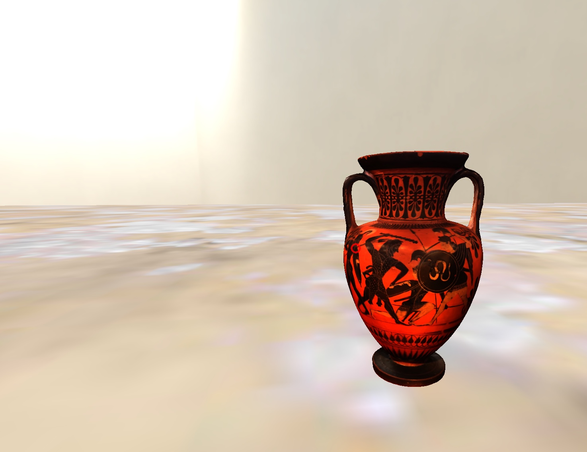
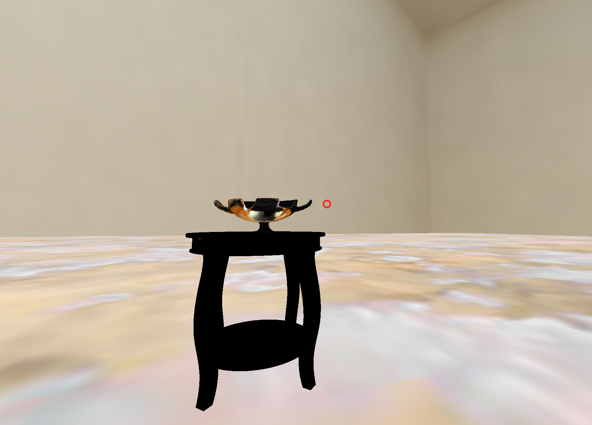

```{r, echo=FALSE, message=FALSE, warning=FALSE}
# DO NOT EDIT THIS BLOCK UNLESS YOU KNOW WHAT YOU ARE DOING:

# Set output types
knitr::opts_chunk$set(
  message = FALSE, warning = FALSE, results= FALSE, fig.width = 16/2, fig.height = 9/2
)

```
# Why Does This Exist?


We started this project for two main reasons: First, the Van Buren Learning Collection lived in the Caverno Room of the Neilson Library, but it was hidden in the archives when we first developed this because Neilson was being rebuilt. Being classics nerds, we missed seeing some of the artifacts that filled us with wonder as first-years. Having virtual galleries while the real one is currently untenable, therefore, was a quick fix for us. Second, we wanted to bring this learning collection into the twenty-first century, in terms of functionality, which is why in each VR gallery, visitors can play each item's audio feature and rotate it. Not only can Smithies still see artifacts from the collection while in reality it lies in the archives, but these galleries help make the Van Buren Learning Collection along with other classical artifacts in the 5-College network more accessible to anyone interested in the classics. Accessibility is a big part of this project, which is why we have a Transcripts page with transcripts of each item's audio if you are in need of that. If there are further accessibility needs, feel free to get in touch with the developer at sabowitz@smith.edu .


# How to Make the Most of Your Tour

Chances are that if you're accessing this webpage on a device, it can probably run gallery spaces as well! Gallery spaces can run on:
  - Oculus Go
  - Mobile devices
  - Desktop

We will walk through tutorials for each of these.


## Oculus Go
When you first open the gallery, using the trigger on your remote, click the spectacles icon in the lower right corner. This will immerse you in the gallery.

When the gallery loads, you'll notice a small red circle, or reticle. To interact with objects and hear their stories, when the reticle is on one object, click the trigger while pointing your remote at the object. 


## Mobile devices
If you are using a Cardboard viewer, press the spectacles icon in the lower right corner to activate that mode. 

When the gallery loads, you'll notice a small red circle, or reticle. To interact with objects and hear their stories, when the reticle is on one object, tap that object.


## Desktop
To go full-screen, click the spectacles icon in the lower right corner.

To look around, click and drag the window. Unlike other platforms, in the desktop version you can move in galleries by using the arrow keys.

When the gallery loads, you'll notice a small red circle, or reticle. To interact with objects and hear their stories, when the reticle is on one object, click on that object.

# Acknowledgements

We would like to thank a lot of people for helping this project get off the ground. 

* Thanks to the **Smith College Museum of Art** for having these objects and allowing them to be accessed from their archives and scanned.
* We thank the **Imaging Center** for scanning the objects in the Greek Vessels gallery.
* Thanks to the **Classics Department of Smith College** for also allowing access to these objects and supporting this project.
* Thank you to **Scott Bradbury** and [**Artstor**](https://library.artstor.org/#/collection/37318) for giving us source information for items that the audio tours rely on.
* And, of course, a special thank you to **Rebecca Worsham** for all her help, inspiration, and advice for this project. If she had not asked the Imaging Center to scan some of the vessels for 3D printing purposes one semester, we would not have this first gallery or be inspired to make this project a real ongoing thing in the first place. She was always there with advice, ready to help us talk through our plans and ideas, and keep us on track when we really needed it.