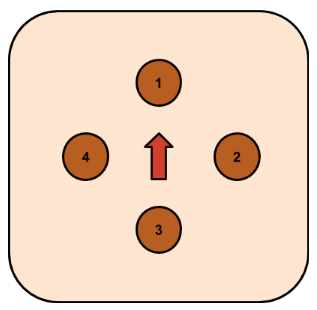

# Curator's Note
Alongside each transcript is a gallery map with keys. The red arrow in each of these represents where visitors stand and look when the gallery is first accessed, and each number corresponds with an item. 
  
# Greek Vessels

## Object 1: Amphora

This amphora was made circa 500 to 525 BCE. The sides of this highly decorated amphora vase feature two different scenes from Greek mythology. On one side, the Greek hero Herakles fights the Amazons, a group of fierce warrior women. On the other, the divinities Apollo, Artemis, their mother Leto, Hermes, and Dionysos gather together. To create this type of ceramic decoration, known as the “black-figure” style, the artist painted figures and objects on an unfired vessel using a clay and water mixture that turned black after firing. Here, the artist articulated the limbs of each figure with incised lines cut into the clay. Other details, such as the white skin of the Amazons and goddesses, and purple accents on the gods’ robes, were painted with a mix of pigment and clay.

## Object 2: Black Glazed Kylix

This black glazed kylix was made around 500 BCE. Its handles enable it to be hung on a wall when not in use as a drinking cup. This cup has a deep bowl and a fairly short foot, but its lines are curving and quite graceful. Kylixes like these would serve their purpose as drinking cups in a sympotic party setting, but in addition they are pictured on pottery as vessels used in the kottabos game, where participants would fling the remaining unfiltered wine dregs at the bottom of their cup at a target, such as a dish floating in a basin of water.

## Object 3: Black Figure Kylix

This black figure kylix was made around 525 BCE. It has a tall stem, and since the contour is broken and there is no figure painting on the vase; it is probably early in date. There is a detail of black figure on a small red slip circle on the inside of the bottom of the cup. Details of that kind are common in one type of kylix. During the sympotic party, the appeal of using that kind of kylix was that it revealed a surprise to the reveler after they finished their drink. This kylix is also known as a lip cup because its rim, or lip, is at a steep angle compared to the rest of the cup’s incline to keep liquid in.

## Object 4: Black Figure Skyphos

This skyphos was made around 500 BCE by a follower of the Haimon Painter. It was mended from ten pieces. The skyphos in everyday life during antiquity served as a deep drinking cup. We know this was inspired by the work of the Haimon Painter because a black-figure tableau with similar composition appears on another skyphos, and the other skyphos was made around the same time and attributed to a follower of the Haimon Painter as well. On the other skyphos, two satyrs cluster around an amphora sprouting vines, and towards the handles but behind the satyrs are trees like the ones in the same spot behind the women on this skyphos.